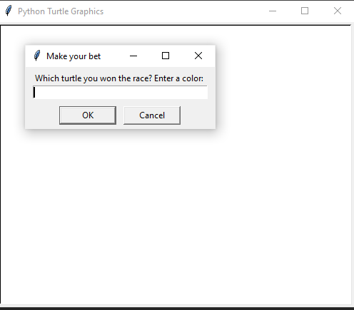
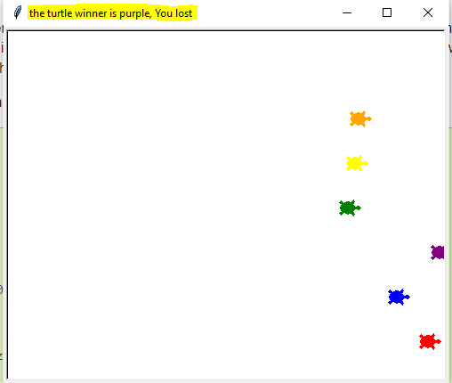

# turtle_race
Game using python turtle package

Try to guess how will win the game:
["red", "blue", "purple", "green", "yellow", "orange"]

After that the game will start.

And the result will show up on the title of the game:

